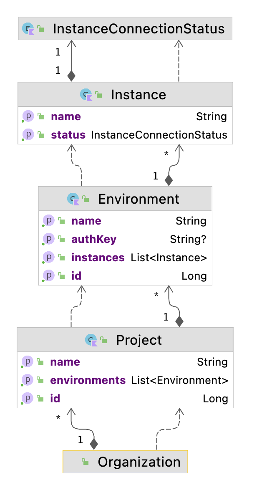

# Портал фича флагов 
Микросервис, который позволят работать с фича флагами разных проектов на разных окружениях.

# Домен


1. **Организация** - сущность самого высокого уровня.
2. **Проект** - в рамках органзации могут быть несколько проектов.
3. **Окружение** - один или несколько серверов объединенные одним предназначением. Например dev, prod 
4. **Сервер окружения** (инстанс) - один из серверов окружения. Например, uat-1, uat-2, qa, dev 
5. **Feature flag** - в рамках проекта существует лишь один фича флаг с данным именем. Включение фича флага происходит индивидуально для каждого окружения, также от окружения к окружению могут отличаться стратегии включения флага. Например, флаг на `uat` может иметь стратегию включения по имени пользователя, чтобы qa-инженер смог протестировать задачу, не мешая работе других пользователей окружения, а на проде у флага стоит стратегию включения на конкретную дату для всех пользователей. 

# Архитектура
В микросервисе используется  clean architecture со следующей структурой модулей:
- **core** - содержит домен, use cases (бизнес логику). Модуль не содержит лишних зависимостей
- **entrypoints** - порты и адапторы для входящих запросов
- **dataproviders** - управляющие порты и адапторы (secondary or driven adaptors). Подключение к БД, очередям и прочее.
- **configuration** - модуль для сборки финального spring-boot микросервиса

```
|--------------|      |--------------|      |--------------|
| entrypoints  |----->|     core     |<-----| dataproviders|
|--------------|      |--------------|      |--------------|
       ^                      ^                    ^
       |                      |                    |
       |             |---------------|             |
       --------------| configuration |--------------
                     |---------------|
```

# Запуск приложения локально
- Добавить в `/etc/hosts` строчку `127.0.0.1  ff.local`
- Если Linux, то в `docker-compose.yaml` необходимо добавить в `nginx-proxy`
  ```
  extra_hosts:
    - "host.docker.internal:host-gateway"
  ```
- `docker-compose up -d`
- Чтобы запускать без регистрации нужно добавить `-Dspring.profiles.active=dev` в `VM options` в конфигурации запуска  `FeatureFlagInstanceManagerApplication.kt`
- Запуск микросервиса

# Technology stack
- **Kotlin 1.6**
- **Maven**
- **SpringBoot 2.6.7**
- **Junit Jupiter**
- **Test containers**
- **Postgres 10**
- **Docker**
- **Helm**
- **Kubernetes**
